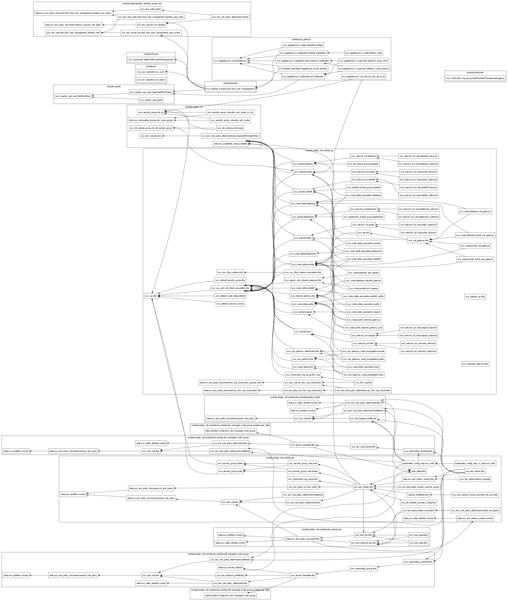

# FIAP: Pós Tech - Software Architecture

## Objetivo do projeto
Gerenciar a infraestrutura necessária para os seguintes projetos:
* [Monolito](https://github.com/postech-fiap-4soat-g01/FastFoodTotem).
* [Lambda](https://github.com/postech-fiap-4soat-g01/FastFoodUserManagement).

## Como usar
É necessário ter uma conta no terraform, um workspace criado, devidas configurações de usuário e adicionar as *Workspace variables* no workspace relacionadas a AWS, que são as seguintes:
* AWS_ACCESS_KEY_ID 
* AWS_SECRET_ACCESS_KEY

Necessário também configurar no GitHub as *Secrets and variables*, entrando em *Actions* e adicionando na parte *Repository secrets* a seguinte:
* TF_API_TOKEN (token gerado pelo terraform para conseguir integrar)

Esse repositório tem um workflow que no momento de criar um pull request, irá criar um speculative plan no terraform não sendo possível aplicar, ao realizar o merge irá realizar um plan e deixará possível ser aplicado manualmente pelo terraform.
Não está aplicando automaticamente pois como o repositório tem várias pessoal alterando, seria perigoso alguém subir algo sem querer e atribuir custos na conta de outra pessoa.
Como toda a infraestrutura está nesse projeto alguns recursos dependem de recursos deployados em outros repositórios, como é o caso da lambda depender da imagem disponível no ECR

### Run 1
Necessário acessar as variables.tf da pasta root e colocar o valor da variável create_lambda como false, fazendo isso é possível aplicar a run inicial.

ATENÇÃO:
* create_lambda = false

### Run 2
Para essa funcionar corretamente é necessário alterar o create_lambda para true e também atualizar o value da variável *integration_uri_lb*, sendo esse o valor do DNS Name do load balancer que foi criado no workflow do repositório do monolito.

ATENÇÃO:
* create_lambda = true
* integration_uri_lb com valor do DNS Name do load balancer

Fluxo:
* RUN 1 do terraform (create_lambda = false)
* Alterações necessárias nos repositórios ([Monolito](https://github.com/postech-fiap-4soat-g01/FastFoodTotem) e [Lambda](https://github.com/postech-fiap-4soat-g01/FastFoodUserManagement))
* 1ª alteração: mudar o endereço do registry do container no arquivo do ([Monolito](https://github.com/postech-fiap-4soat-g01/FastFoodTotem/blob/main/k8s/api-deployment.yaml)) para passar a pegar a imagem do local correto.
* 2ª alteração: Mudar a connection string do banco no arquivo do ([Monolito](https://github.com/postech-fiap-4soat-g01/FastFoodTotem/blob/main/k8s/api-secret.yaml))
* 3ª alteração: executar a action [Deploy to ECR](https://github.com/postech-fiap-4soat-g01/FastFoodTotem/actions/workflows/deploy.yaml) do monolito para subir a imagem para o registry e publicar no EKS.
* 4ª alteração: executar a action [Deploy to ECR](https://github.com/postech-fiap-4soat-g01/FastFoodUserManagement/actions/workflows/deploy.yaml) da lambda para subir a imagem para o registry correto.
* 5ª alteração: Atualizar create_lambda e integration_uri_lb do arquivo [variables.tf](https://github.com/postech-fiap-4soat-g01/aws-infrastructure-live/blob/main/variables.tf). Passar create_lambda = true e integration_uri_lb = ao load balancer criado pelo EKS.
* RUN 2 do terraform
* 6ª alteração: Executar action  [Update Lambda](https://github.com/postech-fiap-4soat-g01/FastFoodUserManagement/actions/workflows/update-lambda.yaml) para atualizar a lambda com a imagem correta.

## Diagrama dos recursos

